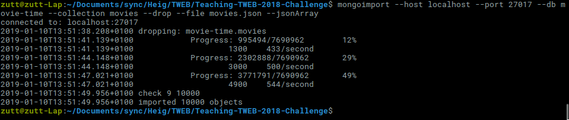

# template_Test_Tweb

#### serveur


1. **Importer une collection de films**

  Ajout de la liste des films dans une base de données local, (impossible en remote sur atlas via mongoimport)




2. **Liste des films**

   - Utilisation de mongoose
   - Model : 

   ```
   const movieSchema = new Schema({
     vote_count: Number,
     video: Boolean,
     vote_average: Number,
     title: String,
     popularity: Number,
     poster_path: String,
     original_language: String,
     original_title: String,
     backdrop_path: String,
     adult: Boolean,
     overview: String,
     release_date: { type: Date },
     tmdb_id: Number,
     genres: [{ type: String }],
   });
   ```

   - Endpoint graphql :

     * NECESSITE LE TOKEN BEARER DANS LE HEADER*

     Utilisation de graphql pour la récupération des movies.

     aller sur : 

     - http://<monURl>/graphql (http://localhost:2000/graphql)


   ```json
   {
     getMovies(begin: 11, number: 30){
       vote_count
       video
       vote_average
       title
       popularity
       poster_path
       original_language
       original_title
       backdrop_path
       adult
       overview
       release_date
       tmdb_id
     }
   }
   ```

   - Begin = entrée par laquelle on commence à récupérer les données.
   - Number = nombre de films que l'on récupère.

   - Pagination via la requête mongoose et l'ajout de number dans la requête graphql.

3. **Authentification**

(le enpoint /api/me me permet de récupérer le user via restAPI, utilisé après le login,lorsque je voulais essayé d'implémenter le frontend)
- Via le frontend vous avez un formulaire pour enregister un compte
- Via le frontend vous avez un formulaire pour vous connecter
- Via le header Autorization et un bearer token.
- Model User :

```
const userSchema = new Schema({
  name: { type: String, required: true },
  lastName: String,
  email: { type: String, unique: true, required: true },
  password: { type: String, required: true },
  inscriptionDate: { type: Date, default: Date.now },
  moviesWatches: [{ type: Schema.ObjectId, ref: 'movies' }],
});
```

- Création du user via une requête graphQL

  ```json
  mutation{
    createUser(input:{
      password : "bittteeeeee",
      name: "Prout",
      lastName: "Yann",
      email: "yannlederrey@gmail.com"
    })
    {
      _id
    }
  }
  ```

- Connection via une reqête sur l'API rest /auth/login en fournissant email et password.


4. **List de movie vues**

Pour récupérer les films on va sur le endpoint graphql getUser : 

```json
{
   getUser(_id: "5c374a081f18d748ae1e6153") {
    moviesWatches {
      vote_count
      video
      vote_average
      title
      popularity
      poster_path
      original_language
      original_title
      backdrop_path
      adult
      overview
      release_date
      tmdb_id
    }
  }
}
```

Pour modifier : 

```json
mutation{
  updateUser(_id: "5c374a081f18d748ae1e6153" input:{
    moviesWatches : ["5c373fdaf0fbcb6d4d0516eb", "5c373fdaf0fbcb6d4d0516e7"]
  })
  {
    _id
    moviesWatches {
      vote_count
      video
      vote_average
      title
      popularity
      poster_path
      original_language
      original_title
      backdrop_path
      adult
      overview
      release_date
      tmdb_id
    }
  }
}
```

- _id correspond à l'id du user et les autres id correspondents à ceux des movies.


#### Frontend 

- formulaire de register

- formulaire de login
- je n'ai pas eu le temps de faire le formulaire pour la modification de sa liste de film ou l'affichage.
